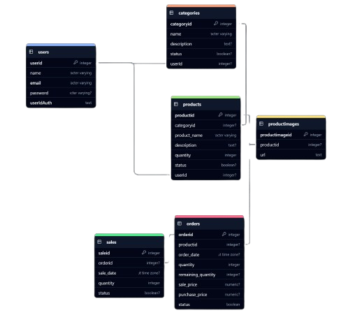

# DANVENTORY - Gestor de Inventario Inteligente


**DANVENTORY** es una aplicación diseñada para la gestión eficiente de inventarios. Permite administrar categorías, productos, órdenes y ventas de manera estructurada. Además, cuenta con un tablero de control para el análisis de ventas y proyecciones financieras, con integración de inteligencia artificial para ofrecer recomendaciones y automatizar decisiones.

---

## Características principales

### 1. **Gestión de Categorías**
- Crear nuevas categorías para organizar los productos.
- Actualizar detalles de una categoría existente.
- Dar de baja categorías que ya no se necesiten.
- Visualizar todas las categorías disponibles.
<div style="display: flex; justify-content: space-around;">
  
  
   
</div>


### 2. **Gestión de Productos**
- Registrar nuevos productos con detalles como nombre, precio y cantidad disponible.
- Actualizar información de productos existentes.
- Dar de baja productos descontinuados o sin stock.
- Visualizar el inventario completo.

<div style="display: flex; justify-content: space-around;">
  
  
   
</div>


### 3. **Gestión de Órdenes**
- Crear nuevas órdenes de compra o venta.
- Actualizar datos de las órdenes según necesidades de operación.
- Dar de baja órdenes completadas o canceladas.
- Visualizar órdenes activas y completadas.

<div style="display: flex; justify-content: space-around;">
  
  
</div>

### 4. **Gestión de Ventas**
- Registrar nuevas ventas con datos detallados.
- Eliminar ventas erróneas o canceladas.
- Visualizar todas las ventas registradas.
- Generar ventas basadas en diferentes métodos de gestión de inventario:
  - **FIFO (First In, First Out)**
  - **LIFO (Last In, First Out)**
  - **Selección manual de órdenes**

<div style="display: flex; justify-content: space-around;">
  
  
</div>

### 5. **Dashboard Inteligente**
- **Ventas por mes**: Análisis de ventas mensuales y proyecciones futuras.
- **Ventas por categoría**: Información detallada del rendimiento por tipo de producto.
- **Cantidad vendida por producto**: Identificación de los artículos más vendidos.
- **Tendencias de ventas**: Gráficos intuitivos para la toma de decisiones.

<div style="display: flex; justify-content: space-around;">
  
  
   
</div>


---

## Inteligencia Artificial en DANVENTORY
DANVENTORY cuenta con IA integrada para optimizar la gestión del inventario y ofrecer recomendaciones estratégicas en:
- **Análisis del Dashboard**, generando insights automáticos.
- **Gestión de categorías, productos y órdenes** con predicciones y sugerencias.
- **Optimización de ventas** para mejorar la rentabilidad.
- **Automatización de decisiones** en base a datos históricos y tendencias.


<div style="display: flex; justify-content: space-around;">
  
  
   
</div>
---

## Configuración del Proyecto
### Variables de entorno (.env)
Para ejecutar DANVENTORY, se deben configurar las siguientes variables:

```env
# Configuración de Supabase
FLUTTER_APP_SUPABASE_URL=
FLUTTER_APP_SUPABASE_ANON_KEY=

# Configuración de Firebase
IOS_CLIENT_ID=
WEB_CLIENT_ID=

# Android Configuration
ANDROID_API_KEY=your_android_api_key
ANDROID_APP_ID=your_android_app_id
ANDROID_MESSAGING_SENDER_ID=your_android_messaging_sender_id
ANDROID_PROJECT_ID=your_android_project_id
ANDROID_STORAGE_BUCKET=your_android_storage_bucket

# iOS Configuration
IOS_API_KEY=your_ios_api_key
IOS_APP_ID=your_ios_app_id
IOS_MESSAGING_SENDER_ID=your_ios_messaging_sender_id
IOS_PROJECT_ID=your_ios_project_id
IOS_STORAGE_BUCKET=your_ios_storage_bucket
IOS_ANDROID_CLIENT_ID=your_ios_android_client_id
IOS_CLIENT_ID=your_ios_client_id
IOS_BUNDLE_ID=your_ios_bundle_id

# Windows Configuration
WINDOWS_API_KEY=your_windows_api_key
WINDOWS_APP_ID=your_windows_app_id
WINDOWS_MESSAGING_SENDER_ID=your_windows_messaging_sender_id
WINDOWS_PROJECT_ID=your_windows_project_id
WINDOWS_AUTH_DOMAIN=your_windows_auth_domain
WINDOWS_STORAGE_BUCKET=your_windows_storage_bucket
WINDOWS_MEASUREMENT_ID=your_windows_measurement_id

# API AI
BASE_URL=
ENDPOINT=
API_KEY=
MODEL=
```

---

## Configuración de Supabase  
DANVENTORY utiliza Supabase como base de datos principal. En la carpeta `documentacion/db` se encuentran:
- **Scripts SQL** para la creación de tablas y estructuras necesarias.



- **Funciones y procedimientos almacenados** para optimizar consultas y operaciones.
    1. Ejecuta primero database.sql
    2. Luego ejecuta functions.sql
    3. Por último, ejecuta dashboardFunction.sql

Para desplegar la base de datos en Supabase:
1. Accede a [Supabase](https://supabase.com/).
2. Crea un nuevo proyecto.
3. Importa los scripts disponibles en `documentacion/db`.
4. Configura las credenciales en el archivo `.env`.
5. Crea un bucket llamado **ProductImages**
---


## Configuración de Firebase    


DANVENTORY requiere Firebase para la autenticación de usuarios. Para habilitarlo:
1. Accede a [Firebase Console](https://console.firebase.google.com/).
2. Crea un nuevo proyecto.
3. Habilita **Autenticación con Google** y **Autenticación con correo electrónico y contraseña**.
4. Configura las credenciales en el archivo `.env`.

---

## Video de demostración
Mira DANVENTORY en acción y descubre cómo optimizar tu inventario de manera inteligente:


---

## Video de demostración de IA
Mira DANVENTORY en acción y descubre cómo optimizar tu inventario de manera inteligente con inteligencia artificial:


---


👨‍💻 **Desarrollador**: [Danny Quezada](https://github.com/Danny-Quezada)

